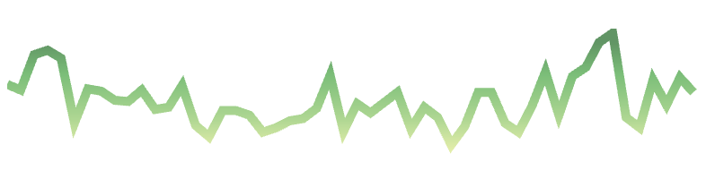
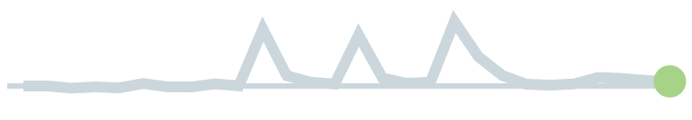
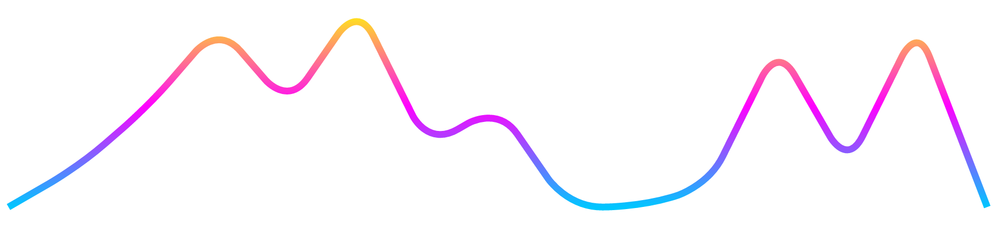

<div align="center">
  <h1>Infinity Trend</h1>
  <br />
  <a href="https://www.npmjs.org/package/infinity-trend"></a> <a href="https://codecov.io/gh/Infinity-Development/infinity-trend" >

</a>
</div>

<hr />

Graphing tools typically require significant expertise and time investment, particularly for complex data visualizations. For simpler tasks like crafting trend lines, this complexity can be overkill. Infinity Trend simplifies this process, offering a React component for creating smooth, responsive trend and line graphs with ease. It draws inspiration from the simplicity and functionality of [react-trend](https://github.com/unsplash/react-trend), ensuring an intuitive and efficient user experience.

## Why Infinity Trend?

- **Simplicity**: Designed for ease of use, integrating seamlessly into your React applications.
- **Elegance**: Produces clean, smooth trend lines that enhance the visual appeal of your projects.
- **Efficiency**: Lightweight component, ensuring minimal impact on your application's performance.
- **Scalable**. Uses SVG for sharp, scalable graphs. Will fill the parent container, or you can provide a fixed size.
- **Animatable**. Support for on-mount animations where the trend graph draws from left to right.
- **Beautiful**. Built-in gradient support, and customizable smoothing.
- **Tiny**. Zero-dependency, gzips to <3kb.

### Inspiration from the Industry

While "Infinity Trend" is designed to simplify the creation of elegant trend graphs, we draw inspiration from industry standards. Below are examples from well-known platforms that embody the sophistication and clarity we strive for:


*GitHub's approach to visualizing repository activity trends.*


*Twitter's method of presenting analytics through trend graphs.*


*Our approach to creating these graphs in a stunning and elegant manor.*

These visualizations serve as benchmarks for the type of intuitive and straightforward graphs that "Infinity Trend" aims to enable developers to create with minimal effort.

### Ideal Use Cases

- Displaying user engagement trends over time.
- Visualizing performance metrics in dashboards.
- Enhancing reports with intuitive data trends.

### Demo

Check out our [playground](https://infinity-development.github.io/infinity-trend/) to mess around with some graphs.

---

## Get Started

Dive into the simplicity and elegance of Infinity Trend. Enhance your applications with meaningful trend graphs today. Contributions and feedback are welcome!

### Installation

```bash
$ yarn add infinity-trend

# Alternatively:
$ npm i -S infinity-trend
```

UMD builds are also available via CDN and expose the component as `Trend`:
- [infinity-trend.js](https://unpkg.com/browse/infinity-trend/umd/infinity-trend.js)
- [infinity-trend.min.js](https://unpkg.com/browse/infinity-trend/umd/infinity-trend.min.js)


### Quickstart

```js
import Trend from 'infinity-trend';

// Simple example to get started
const MyComponent = () => <Trend data={[0, 10, 5, 22, 3.6, 11]} />;
```

### API Reference

#### Basic Props

- **`data`** (required): An array of y-axis values or objects with a `value` property. React Trend normalizes the data, ensuring even spacing.
- **`width`**, **`height`**: Explicit dimensions for the SVG. Defaults to auto-sizing based on the parent container.
- **`padding`**: Adjusts the space around the line to prevent cropping at high `strokeWidth` values. Default is `8`.

#### Styling

- **SVG Props**: Properties like `stroke`, `strokeWidth`, `strokeOpacity`, and others are passed directly to the SVG, allowing for extensive customization.
- **`gradient`**: An array of color values for creating vertical gradients.

#### Animation

- **`autoDraw`**: Animates the line drawing on mount. Customize with `autoDrawDuration` and `autoDrawEasing`.

#### Smoothing

- **`smooth`**: Rounds out peaks for a smoother line. Adjust the curve with the `radius` property.

### Examples

```js
// Animated drawing with custom duration and easing
<Trend data={[120, 149, 193.4]} autoDraw autoDrawDuration={3000} autoDrawEasing="ease-in" />

// Gradient and smoothing for a visually appealing graph
<Trend data={[4, 6, 8]} gradient={['#0FF', '#F0F', '#FF0']} smooth radius={20} />
```